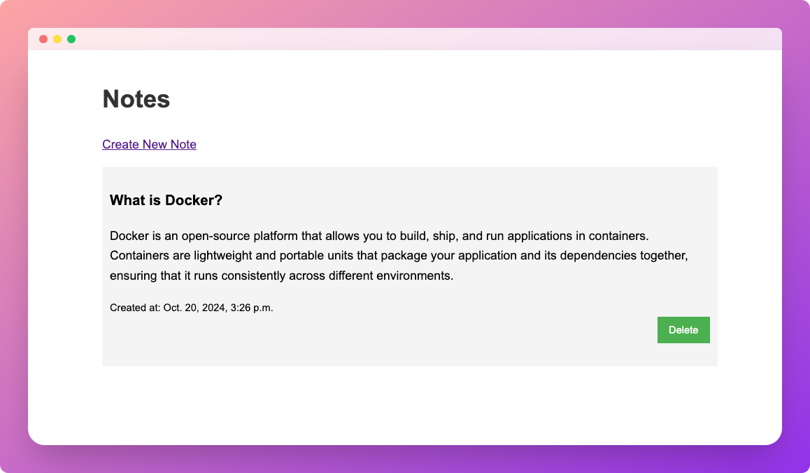

# Django Notes App with Neon Read Replicas

This project demonstrates how to build a simple note-taking application using Django and Neon Postgres, with read replica support for improved scalability and performance.

## Features

- Create, list, and delete notes
- Utilizes Neon Postgres for the database
- Implements read replica support for optimized read operations

## Prerequisites

- Python 3.8+
- Django 3.2+
- A [Neon](https://neon.tech/) account with a project set up

## Installation

1. Clone the repository:
   ```
   git clone https://github.com/dhanushreddy291/neon-read-replica-django
   cd neon-read-replica-django
   ```

2. Create a virtual environment and activate it:
   ```
   python -m venv venv
   source venv/bin/activate  # On Windows, use `venv\Scripts\activate`
   ```

3. Install the required packages:
   ```
   pip install -r requirements.txt
   ```

5. Apply the database migrations:
   ```
   python manage.py migrate
   ```

## Configuration

To use read replicas:

1. Set up a read replica in your Neon project.
2. Update the `DATABASES` setting in `django_notes/settings.py` with your replica information.
3. Ensure the `DATABASE_ROUTERS` setting is configured to use the `PrimaryReplicaRouter`.

## Running the Application

Start the development server:

```
python manage.py runserver
```



Visit `http://localhost:8000` in your web browser to use the application.

## Project Structure

- `django_notes/`: Main project directory
  - `settings.py`: Project settings, including database configuration
- `notes/`: Notes application
  - `models.py`: Defines the Note model
  - `views.py`: Contains view functions for creating, listing, and deleting notes
  - `db_router.py`: Implements the database router for read replica support
- `templates/`: HTML templates for the application

## Contributing

Contributions are welcome! Please feel free to submit a Pull Request.
